# Nicholas Wilde

  

## About Me

Welcome to my profile! I am a passionate open-source developer focused on automating build pipelines, infrastructure as code, and creating reliable container images.

  
  
  
  

## Skills Overview

I work with Docker, Kubernetes, Linux, Python, Go, and CI/CD pipelines.

  
  
  
  
  

## Coding Activity & Metrics

Below are my automatically updated GitHub activity statistics, languages, and WakaTime coding metrics:

### GitHub Statistics & Repositories

  
  

  
  

  

### Contribution History & Habits

  
  

### WakaTime Coding Activity

  

### Achievements

  

